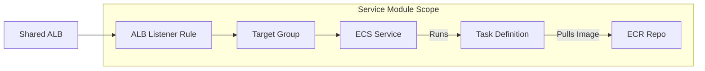

# terraform-aws-fargate-service

## Purpose and Architecture Overview

This module provides a standardized, secure, and scalable pattern for deploying a containerized application to AWS ECS Fargate, securely integrated with shared platform components.

**This module handles all unique service infrastructure:** Task Definition, ECS Service, Target Group, ALB Routing Rule, and API Gateway Route.

**Request Flow:**
A client hits the public **API Gateway** → Traffic tunnels securely via the **VPC Link** → Hits the **Internal ALB** → **Listener Rule** forwards to the correct **Target Group** → Request reaches the **ECS Fargate Task**.



---

## 🏗️ Deployed Components Reference

| Component | Resource Type | Purpose (Operational Focus) |
| :--- | :--- | :--- |
| **ECR Repository** | `aws_ecr_repository` | The secure, immutable registry for your Docker images. Managed as IaC. |
| **ECS Task Definition** | `aws_ecs_task_definition` | The immutable blueprint for the container (CPU, Memory, Image URL). |
| **ECS Service** | `aws_ecs_service` | Maintains the `desired_count` of tasks, manages rolling deployments, and is placed in **Private Subnets** for isolation. |
| **Target Group** | `aws_lb_target_group` | Manages health checks and serves as the destination for traffic routed from the ALB. |
| **ALB Listener Rule** | `aws_lb_listener_rule` | Traffic steering logic: If the request path (`path_pattern`) matches, traffic is forwarded to this service. |
| **API GW Integration** | `aws_apigatewayv2_integration` | The **secure glue** connecting the public API route to the private ALB Target Group via the shared VPC Link. |
| **IAM Task Execution Role** | `aws_iam_role` | Enforces **least privilege** by granting permissions only for ECR image pull and CloudWatch logging. |
| **CloudWatch Log Group**| `aws_cloudwatch_log_group` | Centralized log destination, critical for debugging and observability. |

---

## 💻 Module Usage Example

This example demonstrates how to deploy a new service (e.g., `user-api`) by consuming the necessary IDs from a shared platform module.

### Inputs (Required Variables)

| Variable | Description | Type | Default |
| :--- | :--- | :--- | :--- |
| `service_name` | Unique identifier (e.g., 'user-api'). | `string` | n/a |
| `image_url` | Full ECR URL for the immutable deployment artifact. | `string` | n/a |
| `container_port` | Port exposed by the application container. | `number` | 3000 |
| `path_pattern` | ALB path pattern for routing (e.g., `/api/users/*`). | `string` | n/a |
| `api_route_key` | API Gateway route key (e.g., `ANY /users/{proxy+}`). | `string` | n/a |
| **`ecs_cluster_id`** | ID of the central ECS cluster. | `string` | n/a |
| **`alb_listener_arn`** | ARN of the shared internal ALB listener. | `string` | n/a |
| **`vpc_link_id`** | ID of the shared VPC Link. | `string` | n/a |
| **`private_subnet_ids`** | Target private subnets for placement. | `list(string)` | n/a |

### Example Call

```terraform
# Assume a 'platform' module (or hardcoded data sources) provides the necessary IDs

module "user_api_service" {
  source = "[github.com/your-org/terraform-aws-fargate-service](https://github.com/your-org/terraform-aws-fargate-service)" # Replace with your module source

  # Service Unique Details
  service_name   = "user-api"
  image_url      = var.user_service_image_url
  container_port = 3000
  desired_count  = 3

  # Routing Details
  path_pattern   = "/api/users/*"
  api_route_key  = "ANY /users/{proxy+}"

  # Shared Platform References (Critical Inputs)
  ecs_cluster_id       = module.platform.cluster_id
  alb_listener_arn     = module.platform.alb_listener_arn
  api_gateway_id       = module.platform.api_gateway_id
  vpc_link_id          = module.platform.vpc_link_id
  
  # Networking
  vpc_id               = module.platform.vpc_id
  private_subnet_ids   = module.platform.private_subnet_ids
  security_group_ids   = [module.platform.default_sg_id]
}
